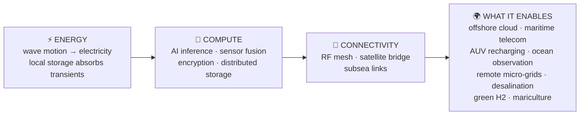
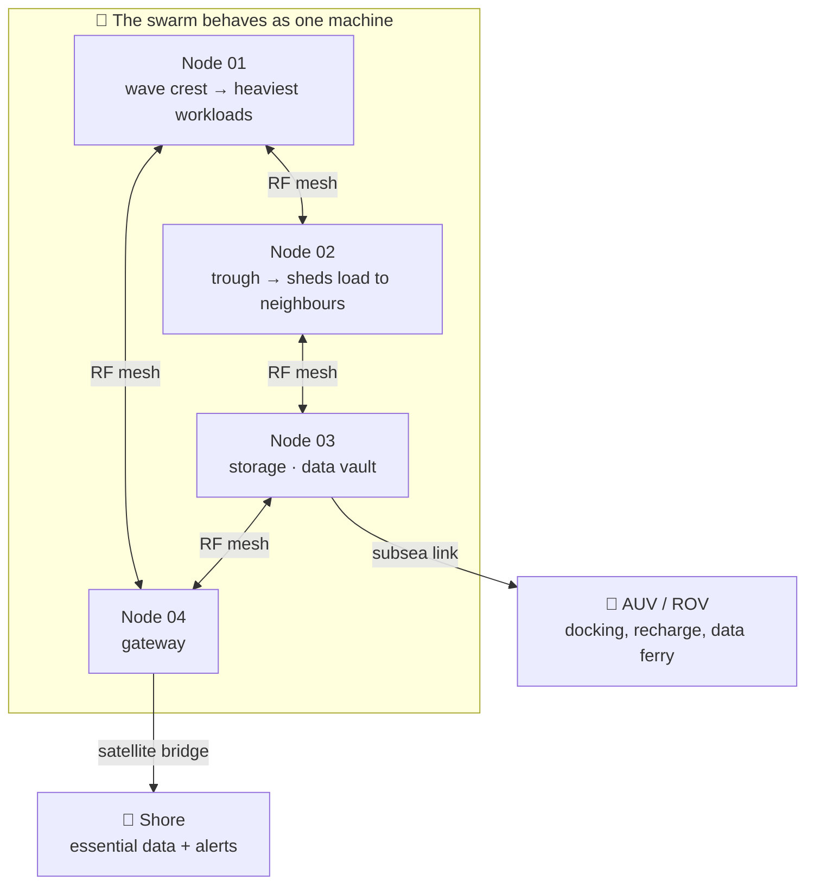
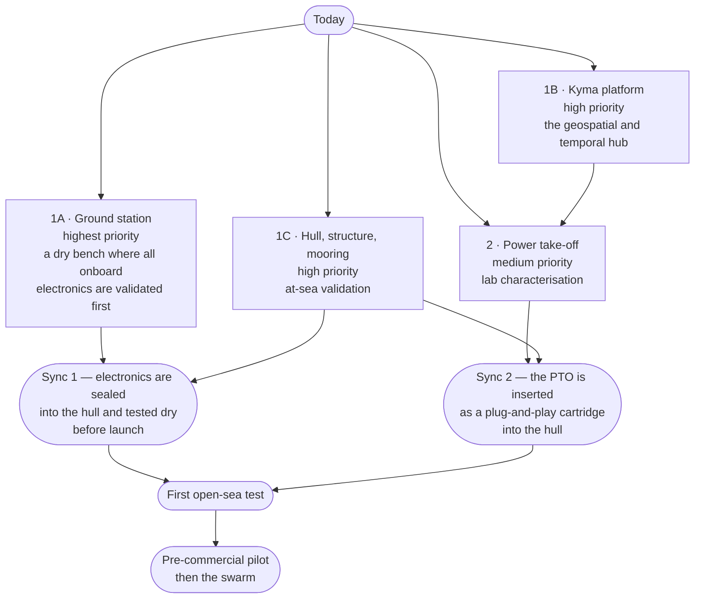

# 🌊 Origami — Technology

### We turn the ocean into a computing surface.

**Not a generator to install. Not a server to place. A living infrastructure that generates, thinks, connects and repairs itself — offshore.**

---

## 🧭 The thesis

The world is running out of places to put its computers.

Data centres need land, they need a power grid able to absorb them, they need energy and water to cool them — and they keep consuming all three. Meanwhile, two thirds of the planet hold an essentially unlimited supply of energy that nobody harvests, and the natural thermal sink that would make cooling free.

**Origami harvests wave energy and consumes it on the spot to produce computation, connectivity and artificial intelligence — offshore.**

The single unit is a hermetic float that turns the motion of the sea into electricity and feeds onboard servers. But **the single unit is not the product**. The product is the *whole*: a swarm of identical nodes that communicate, coordinate, share load and repair each other like a digital nervous system stretched across the surface of the ocean.

> **The energy is not transported — it is consumed where it is born.**
> **The data is not transmitted — it is processed where it is collected.**
> **The sea is not a desert — it is a network.**

The name *Origami* is the Japanese art of folding paper: simple modules that, combined, produce complex and reconfigurable shapes. Every node is identical, interchangeable, replaceable. **The complexity lives in the connections, not in the components.**

---

## 🌊 Why now

Compute demand is accelerating into a physical and environmental wall: scarce land for onshore facilities, power grids that cannot absorb multi-megawatt clusters, artificial cooling that burns a third of the energy a data centre consumes, and a growing ecological burden on the territories that host it.

| The wall | Origami's answer |
|---|---|
| **No more land** | *Endless blue* — the largest unused space on Earth |
| **No more grid** | Energy generated exactly where it is consumed: no transmission, no waiting list |
| **No more cooling budget** | *Natural heat sink* — passive subsea cooling, PUE 1.0–1.1 |
| **No more externalities** | Zero-emission offshore compute, plus a permanent observatory on the state of the ocean |

There is a second reason, less economic and just as important: **whoever can compute, connect and observe far offshore gains sovereignty** — over data, over maritime awareness, over infrastructure that keeps working when terrestrial systems fail.

---

## ⚙️ One architecture, three layers

Every node is a self-contained cell that performs three functions at once:

- **Energy** — a wave energy converter with a sealed hull and a reactive internal mass. Nothing that moves ever touches seawater: the power take-off works dry, in an inert atmosphere. Each node also drives an onboard observation suite (temperature, pressure, salinity, currents, biochemistry) and exposes an emergency surface that can host solar panels, making the unit a **hybrid wave–solar generator**.
- **Compute** — onboard servers run the workload *there*: AI inference, encryption, distributed storage. Processing at the edge removes the dependency on expensive, high-latency satellite links and turns latency into an engineering choice instead of a constraint.
- **Connectivity** — a self-configuring radio mesh between neighbouring nodes, a satellite bridge toward shore for essential data and alarms, and subsea links for drones and submerged sensors.

At a glance: a 10-tonne float, 7 m × 1.5 m, a few kilowatts of installed generation per module, tens of megawatt-hours per year, cooled by the sea, moored on three lines. Nothing in those numbers is the point — **they are the resolution of the idea: small, repeatable, replicable cells.**

---

## 🐙 The swarm — the infrastructure *is* the product

A network of identical cells is not a collection of machines. It is a system with **emergent properties**:

- **Energy-aware scheduling** — the swarm distributes computational load according to instantaneous wave availability. A node riding a crest runs the heaviest workloads; a node in a trough reduces its own and borrows capacity from its neighbours over the radio link.
- **Reconfigurability** — nodes are not planted for life: they can migrate seasonally, following currents and the best wave regimes, repositioning in formation with their own underwater drones.
- **Self-healing** — when a node is lost, the swarm detects the absence, redistributes the load and rebuilds the network topology. The node is repaired or replaced without interrupting the service.
- **Swarm intelligence** — distributed algorithms tune the geometry of the fleet to maximise collective energy capture, avoid wave shadowing between neighbours and keep the network connected.

### There is no centre

Every node carries its own storage, its own power bus, its own computer, its own communication stack. **The network is designed to lose a third of its units and keep operating — degraded, never blacked out.** Removing the single point of failure is an architectural requirement, not a feature.

### The ocean becomes an observatory

Nodes are not inert. A deployed fleet is a **permanent, distributed oceanographic observatory**: seawater parameters, currents and weather measured continuously; oil spills, vessel patterns and marine mammals detected; environmental data certified for sustainability reporting. The same fleet can host, recharge and relay autonomous underwater vehicles that would otherwise need a support ship — replacing vessel days with resident robotics.

---

## 🚀 What we are doing now — and why

We are not chasing a finished product. We are **buying down risk in the right order**, so that failures happen on a table in a laboratory instead of in the open sea in winter.

**Three pillars, in parallel.** The **hull** goes to sea first, instrumented but without a power take-off, so that naval risk — tightness, stability, anchoring — surfaces before the complete system is afloat. The **power take-off** is designed and characterised in the laboratory, on a test bench that reproduces at-sea loads measured in the real world. **Kyma**, the software pillar, turns those measurements into a unified, queryable picture of the ocean — and into a product with its own market.

**Four work packages.** The **ground station** comes first: validate every sensor, radio and power path on a bench, before sealing anything into a watertight bay. Then the **hull with its mooring** and the **Kyma platform** in parallel. Then the **lab power take-off**, which can advance independently and gets better as soon as real sea data arrives.

**Why this order.** Every integration error caught on land is an error that will never cost a vessel day, a weather window or a recovery operation. The hull reserves a **flanged, plug-and-play bay** for the power take-off from day one, so the hull investment stays valid even if the conversion concept evolves.

### An honest map of what must still be solved

- **Survival** — extreme sea states, storm loads, fatigue.
- **The marine environment** — corrosion, biofouling, marine growth, and proving the environmental footprint (thermal plume, acoustic impact, ecosystem interference) with data rather than declarations.
- **Protection** — mooring and subsea links safe from fishing gear and traffic; physical security of unattended hardware.
- **Compute at sea** — storage and servers surviving constant motion and vibration.
- **Economy of scale** — taking assembly, deployment and recovery cost out of a system that must be built hundreds of times.
- **Permissions and logistics** — marine concessions, insurance, weather windows, recovery procedures.

These are the questions the prototype exists to answer.

---

## 🗺️ Kyma — offshore intelligence

**Kyma turns complex marine data into a live, interactive map of the sea.**

It has two lives. Internally, it is the **instrumentation** of Origami: it fuses the fleet's telemetry with global meteo-oceanographic flows — waves, wind, currents, bathymetry, vessel traffic — and turns them into the load profiles and site decisions that drive the laboratory and the sea trials. Commercially, it is a **standalone blue-economy product**: weather routing, maritime intelligence, ocean data analytics. Recurring revenue **before the first float is in the water**.

Data comes from AIS vessel traffic, Copernicus/CMEMS oceanography, CEMS early warning and EMODnet offshore assets. The platform is a modular microservice stack with a WebGL globe frontend, a time-series and geospatial backbone and a single gateway.

→ **[github.com/Kyma-ORG](https://github.com/Kyma-ORG)**

---

## 🧪 Open source

Part of our engineering is public: the simulation and tooling that make our device testable before it exists.

| Repository | What it is |
|---|---|
| [`SwarmAreaCoverage`](https://github.com/Origami-WEC/SwarmAreaCoverage) | Swarm area-coverage simulation: how agents cooperate to cover a sea area |
| [`gz-mooring`](https://github.com/Origami-WEC/gz-mooring) | Mooring plugin for gz-sim (MoorDyn): fairlead forces and line tension |
| [`wec-tools`](https://github.com/Origami-WEC/wec-tools) | gz-sim plugins for wave energy converter dynamics + telemetry dashboard |
| [`cad-to-gazebo`](https://github.com/Origami-WEC/cad-to-gazebo) | FreeCAD → Gazebo: taking mechanical design into simulation |
| [`gazebo-sim`](https://github.com/Origami-WEC/gazebo-sim) | Wave and surface plugins for Gazebo — mirror of upstream [`srmainwaring/asv_wave_sim`](https://github.com/srmainwaring/asv_wave_sim), all credits to the original authors |

The rest of the stack — multibody hydrodynamics, boundary-element analysis, particle CFD, sea-state data pipelines, bench-test post-processing, embedded firmware and the internal platform — is developed in private repositories by the team.

---

## 🛠️ What we build with

`FreeCAD` · `Gazebo / gz-sim` · `MoorDyn` · `DualSPHysics` · `Capytaine / Nemoh` · `Rust` · `Python` · `ROS 2` · `Go` · `Svelte` · `MapLibre GL` · `Deck.gl` · `Apache Arrow` · `PostgreSQL / TimescaleDB / PostGIS` · `Redis` · `Docker` · `GitHub Actions`

---

## 👥 Team & careers

Origami was born in the research environment of **Politecnico di Milano**, won **Switch2Product** and joined the **Polihub** incubation programme. We are a small team with a large machine to build, and we are looking for strong engineers and ambitious minds — mechatronics and embedded systems, hydrodynamics and marine mechanical engineering, full-stack software, applied data science and signal processing — including thesis paths with real hardware, real sea data and real responsibility.

📬 Write to us for positions, collaborations or thesis projects.

---

## 📞 Get in touch

| | |
|---|---|
| 🌐 **Website** | [www.origami-technology.com](https://www.origami-technology.com) |
| 🗺️ **Kyma platform** | [kyma.origami-technology.com](https://kyma.origami-technology.com) |
| 💼 **LinkedIn** | [Origami Technology](https://www.linkedin.com/company/origamitechnology) |
| ✉️ **Email** | [info@origami-technology.com](mailto:info@origami-technology.com) |
| 📍 **Where** | Italy 🇮🇹 |

 
<b>Origami is not a machine waiting for someone to buy its electricity. It is the nervous system that turns the ocean into a habitable digital frontier.</b>

