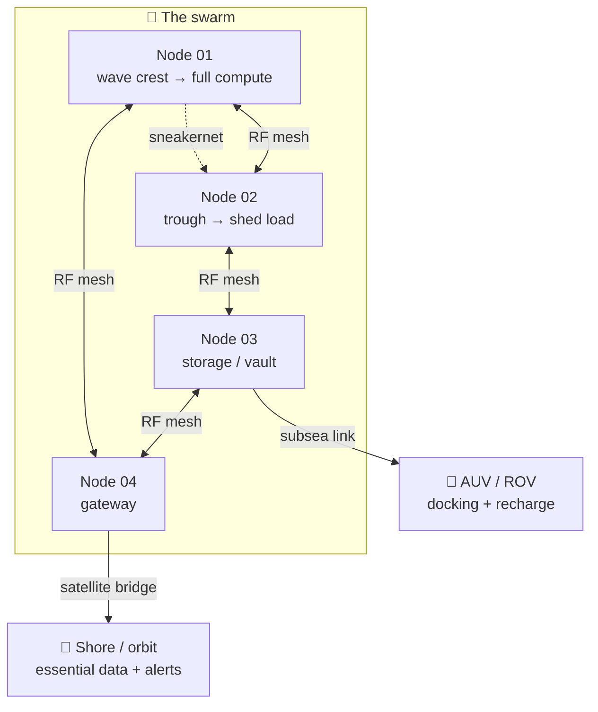
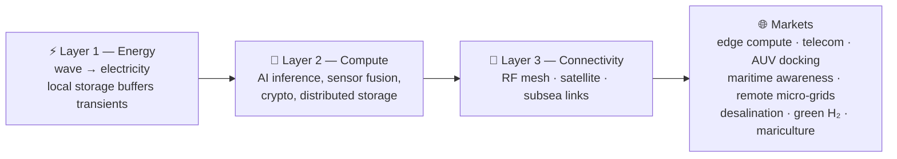
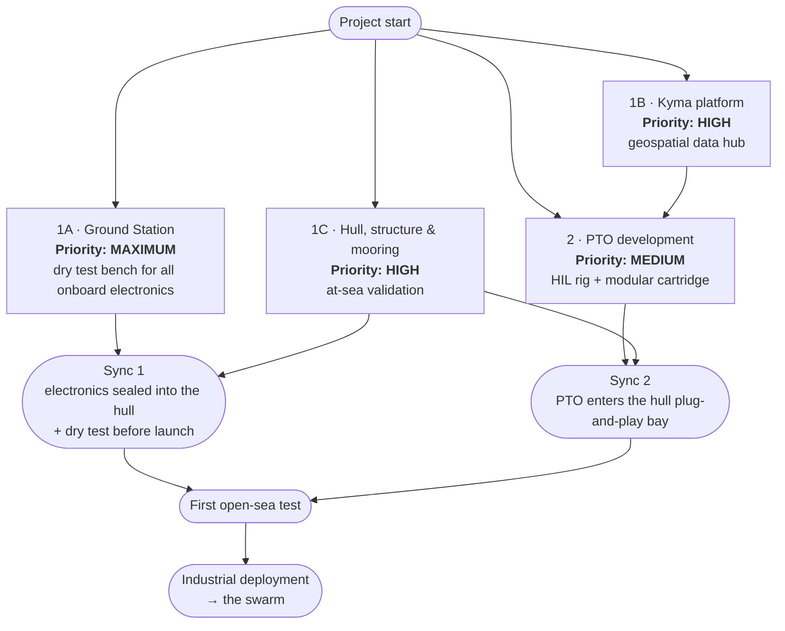

# 🌊 Origami — Technology

### Turning ocean waves into compute, connectivity and intelligence.

**We are not building a generator. We are building the nervous system that makes the ocean computable.**

---

## 🧭 What Origami is

**Origami is a distributed, modular, autonomous infrastructure that generates energy from ocean waves and consumes it on the spot to produce computation, connectivity and AI offshore.**

Each node of the network is a hermetic 10-tonne float (7 m × 1.5 m). But *the single unit is not the product*. The product is the **collaborative whole**: a swarm of identical nodes that communicate, coordinate and self-organise like a digital nervous system stretched across the surface of the ocean.

The name *Origami* evokes the Japanese art of folding paper: simple modules that, combined, produce complex and reconfigurable shapes. Every node is identical, interchangeable, replaceable. **The complexity lives in the connections, not in the components.**

> The energy is not transported — it is consumed where it is born.
> The data is not transmitted — it is processed where it is collected.
> The sea is not a desert — it is a network.

### Why now

As global demand for compute accelerates, traditional data centres are hitting a physical and environmental wall:

| The wall | What it costs today | Origami's answer |
|---|---|---|
| **Land consumption** | Onshore facilities compete for scarce urban and industrial land | *Endless blue* — the largest unused space on the planet |
| **Grid saturation** | Power grids cannot absorb multi-megawatt compute clusters | *Generation at the point of use* — untapped wave energy, no transmission losses |
| **Cooling inefficiency** | Artificial cooling wastes 30–40% of the energy a data centre consumes | *Natural heat sink* — passive subsea cooling, PUE 1.0–1.1 |
| **Environmental impact** | Heavy burden on local ecosystems and resources | *Zero-emission offshore compute* + continuous ocean observation |

---

## ⚙️ The anatomy of a node

A single module is a **Wave Energy Converter (WEC) with a sealed hull**: a vertical cylindrical body (7 m × 1.5 m, 10 t) hosting a reinforced-concrete reactive mass (7,140 kg) that oscillates relative to the outer hull. The relative motion drives an electric generator through a **double-sided rack-and-pinion transmission with one-way clutches**, which rectifies the alternating motion into continuous rotation.

The whole Power Take-Off lives in a **sealed, dry, inert-atmosphere environment**: no moving part ever touches seawater.

| Spec | Value |
|---|---|
| Hull | 7 m × 1.5 m, hermetic, ~10 t |
| Reactive mass | 7,140 kg reinforced concrete |
| Rated power | 5 kW per module |
| Annual yield | 40–50 MWh/year per module |
| Transmission | Double-sided rack & pinion + one-way clutches (variable ratio) |
| PTO environment | Sealed, dry, inert — no seawater contact |
| Emergency surface | 64 m² — hosts PV panels → **hybrid wave–solar** |
| LCOE | 122–256 EUR/MWh |
| Energy storage | Modular 19" racks, 5 kWh each (Li-ion / solid-state) |
| DC bus | 48 V nominal (52 V real), onboard computer (OBC) |
| Cooling | Passive subsea heat exchange — **PUE 1.0–1.1** |
| Mooring | 3 lines, intelligent automatic release, AUV repositioning |
| Patent | Filed application **P11589IT00** — two-body architecture, active volume/density variation, variable-ratio transmission |

What the energy actually feeds:

- 🖥️ **Compute servers** — edge computing, AI inference, encrypted storage
- 🌡️ **Multi-parametric oceanographic sensors** — temperature, pressure, salinity, currents, biochemistry
- 📡 **Communication antennas** — RF mesh, satellite bridge, subsea links

---

## 🐙 The swarm — the infrastructure *is* the product

Nodes are not isolated units. They form a **self-organising wireless mesh network** with emergent properties:

- **Energy-aware scheduling** — the swarm balances compute load against instantaneous wave availability. A node on a wave crest runs the heaviest workloads; a node in a trough sheds load and borrows capacity from its neighbours over the radio link.
- **Physical reconfigurability** — nodes can *migrate seasonally*, following currents and optimal wave regimes, repositioning in formation with integrated underwater drones.
- **Self-healing** — if a node fails, the swarm detects the absence, redistributes the load and reconfigures the network topology. The failed node is repaired or replaced by a drone **without interrupting the service**.
- **Swarm intelligence** — distributed algorithms optimise node geometry to maximise collective energy capture, minimise wave shadowing between neighbouring units and preserve network connectivity.

### No single point of failure

There is no centre. Every node is an autonomous agent with its own batteries, its own DC bus, its own onboard computer and its own communication stack. **The network can lose 30% of its nodes and keep operating — degraded, but without a blackout.** Eliminating the single point of failure is an architectural requirement, not an option.

### Three coexisting layers

---

## 🔬 What we are doing right now — and why

The programme runs on **three pillars that advance in parallel** with different priorities, designed to maximise de-risking and shorten time-to-market:

1. **Hull & structure (sea first).** The float goes in the water *before* the PTO exists, instrumented with sensors: the goal is not energy, it is validating hydrodynamic response, structural integrity and mooring loads in real sea conditions. This separates naval risk from mechanical risk — leaks, stability and anchoring problems surface before the complete system is afloat.
2. **Power Take-Off (in the lab).** The energy heart of the system is designed and characterised on a **Hardware-in-the-Loop test rig**, fed by load profiles that come directly from the hull's at-sea data. A continuous loop: the sea generates data → Kyma turns it into commands → the lab tests the PTO on real conditions → efficiency parameters flow back into the design.
3. **Kyma (the software).** The geospatial and temporal hub of the whole system — and a standalone commercial product in its own right.

These pillars are organised into **four work packages**:

**Why this order.** The **Ground Station** (1A) is the highest priority: a dry bench where onboard electronics, sensors, modems, the AIS antenna and the energy management system are validated *before* being sealed into the watertight bays. Integration risks are killed on a table, not at sea. **Kyma** (1B) and the **hull with its mooring** (1C) advance in parallel; the **lab PTO** (2) has medium priority because it can progress independently and benefit from real data collected at sea.

The hull's PTO bay is designed from day one as a **flanged, plug-and-play cartridge slot** (mechanical interface, marine electrical connectors, CANbus field bus), so the hull investment stays valid even if the PTO concept evolves.

---

## 🗺️ Kyma — Offshore Intelligence Platform

**Kyma turns complex scientific marine datasets into interactive, high-frame-rate dashboards** — and it is the geographic brain that connects the sea nodes to the shore.

It has a **double role**:

- 🧰 **Internal instrumentation** during Origami's sea-test phases — telemetry fusion, load-profile generation for the HIL rig, site selection;
- 💼 **Blue-economy product** with its own revenue: weather routing, maritime intelligence and ocean-data analytics sold to shipowners, offshore operators and research centres — **recurring revenue before the first float hits the water**.

| Data source | What it brings |
|---|---|
| **AIS** | Vessel traffic, positions, routes |
| **Copernicus / CMEMS** | Oceanography: currents, temperature, sea state |
| **CEMS** | Early warning |
| **EMODnet** | Offshore assets and European marine data |

Architecture: modular microservices, WebGL globe frontend (Svelte + MapLibre GL + Deck.gl + Apache Arrow), TimescaleDB/PostGIS, Caddy gateway. → **[github.com/Kyma-ORG](https://github.com/Kyma-ORG)**

---

## 🚀 Roadmap

| Phase | Milestone | Content |
|:---:|---|---|
| **PoC · TRL 3** | **First prototype** | 1 kW IT peak power. Tests on the device: energy, computing, cooling |
| **PoC · TRL 6** | **First network** | 5 devices. Tests on the system: connection, network, operation |
| **Swarm life** | **The swarm** | Scale deployment and production. Sea-cloud with high installed IT power → **market-ready** |

---

## 🧪 Open source

Part of our engineering is public — simulation, tooling and research:

| Repository | What it is |
|---|---|
| [`SwarmAreaCoverage`](https://github.com/Origami-WEC/SwarmAreaCoverage) | Swarm area-coverage simulation: how agents cooperate to cover a sea area |
| [`gz-mooring`](https://github.com/Origami-WEC/gz-mooring) | **gz-sim** mooring plugin (MoorDyn v2.7.1): fairlead forces, line tension on `/mooring/tension` |
| [`wec-tools`](https://github.com/Origami-WEC/wec-tools) | gz-sim plugins for WEC dynamics + QML telemetry dashboard |
| [`cad-to-gazebo`](https://github.com/Origami-WEC/cad-to-gazebo) | FreeCAD → SDF/Gazebo conversion: assemblies, materials, manifest export |
| [`gazebo-sim`](https://github.com/Origami-WEC/gazebo-sim) | Wave & surface plugins for Gazebo — mirror of upstream [`srmainwaring/asv_wave_sim`](https://github.com/srmainwaring/asv_wave_sim), all credits to the original authors |

The rest of the stack — hydrodynamic simulation (FreeCAD → Gazebo pipeline, SI-unit multibody), BEM analysis (Nemoh/Capytaine), SPH CFD, sea-state data pipelines, lab-test post-processing, ROS2 sensor firmware and the whole internal platform — is developed in private repositories by the team.

---

## 🛠️ Technology

`FreeCAD` · `Gazebo / gz-sim` · `SDF` · `MoorDyn` · `DualSPHysics` · `Capytaine / Nemoh` · `Rust` · `Python` · `Streamlit` · `Qt / QML` · `ROS 2` · `Go` · `Svelte` · `MapLibre GL` · `Deck.gl` · `Apache Arrow` · `PostgreSQL / TimescaleDB / PostGIS` · `Redis` · `MQTT` · `Docker / Docker Compose` · `GitHub Actions`

---

## 👥 Team & careers

Origami was born in the research environment of **Politecnico di Milano**, won **Switch2Product** and joined the **Polihub** incubation programme. We are a small, fast team looking for strong engineers and ambitious minds to run the first device tests.

Career paths span **mechatronics & embedded systems**, **hydrodynamics & marine mechanical engineering**, **full-stack software engineering** and **applied data science & signal processing** — including thesis paths with real hardware, real sea data and real responsibility.

📬 Write to us for positions, collaborations or thesis projects.

---

## 📞 Get in touch

| | |
|---|---|
| 🌐 **Website** | [www.origami-technology.com](https://www.origami-technology.com) |
| 🗺️ **Kyma platform** | [kyma.origami-technology.com](https://kyma.origami-technology.com) |
| 💼 **LinkedIn** | [Origami Technology](https://www.linkedin.com/company/origamitechnology) |
| ✉️ **Email** | [info@origami-technology.com](mailto:info@origami-technology.com) |
| 📍 **Where** | Italy 🇮🇹 |

 
<b>Origami is not a machine waiting for someone to buy its electricity. It is the nervous system that turns the ocean into a habitable digital frontier.</b>

